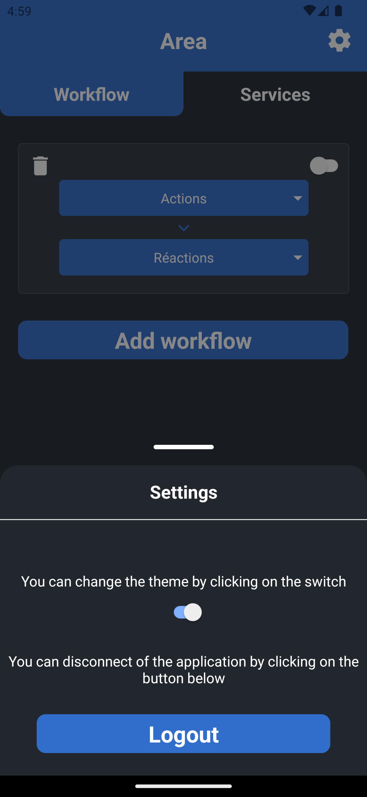

# User Guide

This document describes how to use the mobile application of our project.

## Table of Contents

- [User Guide](#user-guide)
  - [Table of Contents](#table-of-contents)
  - [Introduction](#introduction)
  - [Login / Register Page](#login--register-page)
  - [Home Page](#home-page)
    - [Workflows](#workflows)
    - [Services](#services)
  - [Settings](#settings)

## Introduction

When you open the application, you will see the login screen. From there, you can login with an existing account or you can register by clicking on the `Sign up` button.

## Login / Register Page

To login, you can use the following credentials:

- Email
- Password

  
  

## Home Page

Once you are logged in, you will be redirected to the home screen. From there, you can navigate through the two different sections of the app: `workflows` and `services`.

### Workflows

The workflows section allows you to see and create different workflows. Each workflow represents a set of actions and reactions that you can pick, and enable it or not.

Each workflow action and reaction in the list displays a brief description and an icon or image that represents the action/reaction.

  
  
  

### Services

The services section displays a list of available services. You can connect to a service by logged in yourself to it to access and be able to use different actions/reactions.

  
  

## Settings

The settings section allows you to change between dark mode and light mode. You can log you out of the app.

  
  

[//]: # (End of user_guide.md)

[//]: # (Path: Mobile/doc/user_guide.md)
