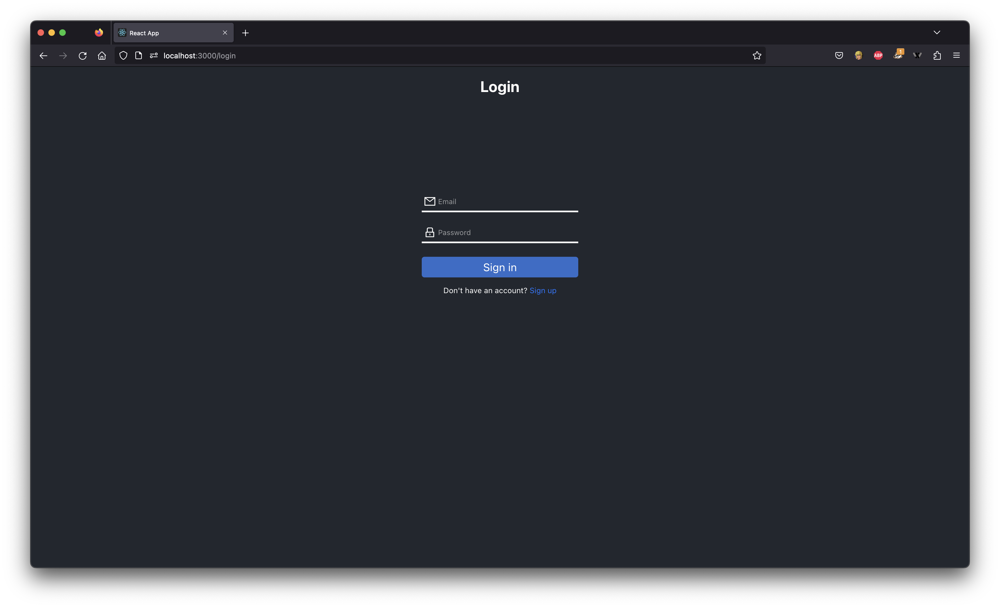
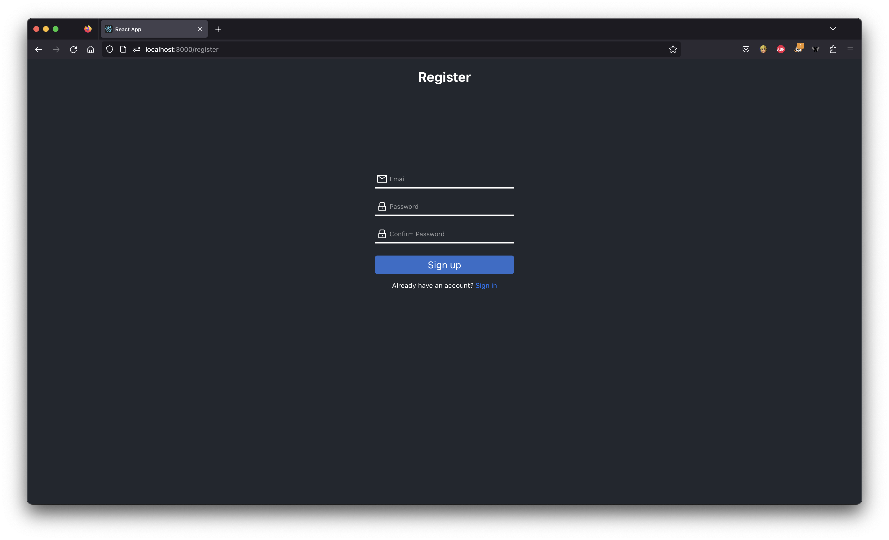
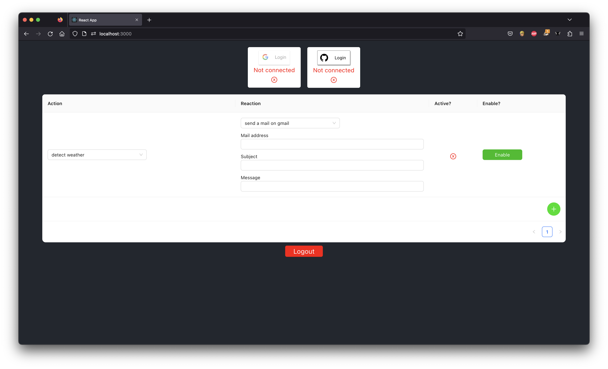
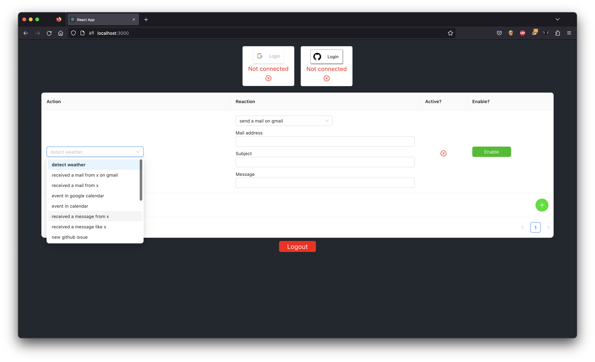
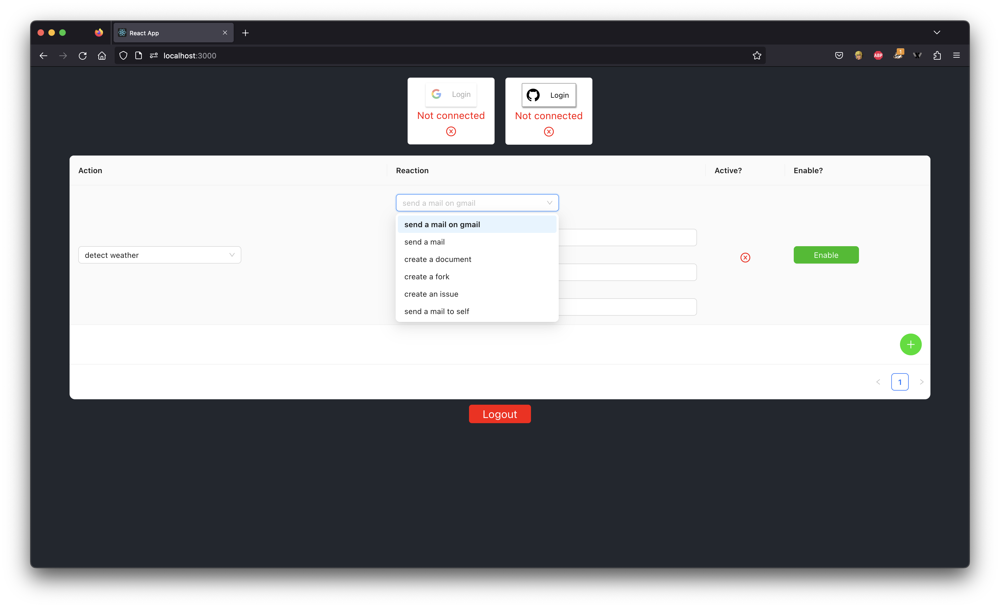

# User Guide

This document describes how to use the web application of our project.

## Table of Contents

- [User Guide](#user-guide)
  - [Table of Contents](#table-of-contents)
  - [Introduction](#introduction)
  - [Login / Register Page](#login--register-page)
  - [Home Page](#home-page)
    - [Actions](#actions)
    - [Reactions](#reactions)

## Introduction

This is the user guide for the web application.

When you open the application, you will see the login screen. From there, you can login with an existing account or you can register by clicking on the `Sign up` button.

## Login / Register Page

To login, you can use the following credentials:

- Email
- Password

## Home Page

Once you are logged in, you will be redirected to the home screen. From there, you can add workflows based on `actions` and `reactions`.

You can select one action and one reaction to constitute one complete workflow.

### Actions

The actions section allows you to see different actions. Each action represents a set of actions that you can pick, and enable it or not.

### Reactions

The reactions section allows you to see different reactions. Each reaction represents a set of reactions that you can pick, and enable it or not.

[//]: # (End of user_guide.md)

[//]: # (Path: Web/doc/user_guide.md)

