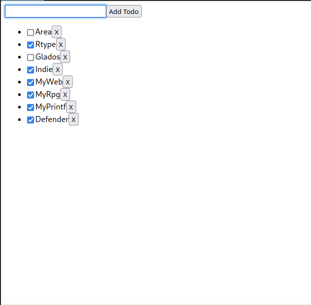

# Area TechStack Document

## Application Server

### Rust

Rust est un nouveau language assez populaire qui permet d'optimiser au maximum
les performances de la machine sur laquelle il tourne. Et même si cela peut
paraître intéressant d'un point de vue d'optimisation, rust demande une certaine
rigueure dont NodeJS et Python s'abstiennent. (De plus, le sujet ne demande pas
d'optimisation ou de temps limite de requête.)

Aussi, même si Chloé & Clovis connaissent Rust, ce n'est pas le cas des autres membres du
groupe, et dans le cas d'un changement de poste, il faudra donc apprendre le
language durant le temps de développement. Cela pourrait nous être détrimental.

### NodeJS + Express

NodeJS est un environnement permettant de faire des serveurs applicatifs en JavaScript. Cela pourrait **unifier notre stack technologique** si nos technologies front-end sont des frameworks également en JavaScript.

JavaScript à également l'avantage d'être assez **performant**. (pas autant que rust mais plus que python)

Sa **syntaxe** peut néanmoins être **complexe** et son **architecture** peut également s'avérer **fastidieuse** (de mon point de vue).

Voici un exemple d'API rest à l'aide d'express

```javascript
const express = require('express')
const app = express()
const port = 3000

app.get('/', (req, res) => {
  res.send('Hello World!')
})

app.listen(port, () => {
  console.log(`Example app listening on port ${port}`)
})
```

### Python + Flask

Python est **facile à lire** et est **rapide à développer.**
Il a le désavantage d'être **plutot lent** (en temps d'execution)
mais l'optimisation n'étant pas notre objectif, ce ne sera pas pris en compte
Python à également l'avantage d'être considéré comme le language **parfait pour
l'automation**, permettant de **travailler avec plein d'API très facilement.**

Voici un exemple d'API rest à l'aide de Flask

```python
from flask import Flask

app = Flask("Area")

@app.route("/")
def index():
  return "Area, hello world"

if __name__ == "__main__":
  app.run(port="3000")
```

## Web Client

### Kotlin (web)

Voir ci-dessous la rubrique Mobile Client - Kotlin.

Kotlin permet d’**étendre son projet au web**.

### Vue.js

Vue.js, est un framework JavaScript open-source utilisé pour construire des interfaces utilisateur et des applications web monopages.

Vue a pour avantage d'avoir ses **fichiers légers et flexibles** en termes de support pour les nouveaux programmeurs.

Cependant Vue à des caractéristique très similaire à d'autre framwork, tel que React. Mais moins de personnes utilisent Vue, il y a donc **moins de communauté**. Il sera donc plus difficile de trouver de la documentation et de l'aide.

Voici un exemple :

``` vue
<script>
let id = 0

export default {
  data() {
    return {
      newTodo: '',
      hideCompleted: false,
      todos: [
        { id: id++, text: 'Learn HTML', done: true },
        { id: id++, text: 'Learn JavaScript', done: true },
        { id: id++, text: 'Learn Vue', done: false }
      ]
    }
  },
  methods: {
    addTodo() {
      this.todos.push({ id: id++, text: this.newTodo, done: false })
      this.newTodo = ''
    },
    removeTodo(todo) {
      this.todos = this.todos.filter((t) => t !== todo)
    }
  }
}
</script>

<template>
  <form @submit.prevent="addTodo">
    <input v-model="newTodo">
    <button>Add Todo</button>
  </form>
  <ul>
    <li v-for="todo in todos" :key="todo.id">
      <input type="checkbox" v-model="todo.done">
      <span :class="{ done: todo.done }">{{ todo.text }}</span>
      <button @click="removeTodo(todo)">X</button>
    </li>
  </ul>
</template>

<style>
.done {
  text-decoration: line-through;
}
</style>
```

On obtient le résultat :




### Elm

Elm est un langage de programmation fonctionnel qui permet de créer des interfaces graphiques pour le web ainsi que des jeux. Il compile le code en JavaScript.

Le langage frontend Elm est **évolutif et moins sujet aux erreurs**. Il dispose d’un compilateur extrêmement utile qui veille à ce que le code soit lisible et facile à maintenir.

Cependant, la **syntaxe est très différente** de ce que l'on connait. Ce qui risque fortement d'**augmenter le temps de formation**.

Par exemple :

```elm
import Browser
import Html exposing (Html, button, div, text)
import Html.Events exposing (onClick)

main =
  Browser.sandbox { init = 0, update = update, view = view }

type Msg = Increment | Decrement

update msg model =
  case msg of
    Increment ->
      model + 1

    Decrement ->
      model - 1

view model =
  div []
    [ button [ onClick Decrement ] [ text "-" ]
    , div [] [ text (String.fromInt model) ]
    , button [ onClick Increment ] [ text "+" ]
    ]
```

On obtient le résultat


### React / TypeScript

React est une librairie JavaScript open-source. Il est utilisé pour construire des interfaces utilisateur et des applications web monopages. C'est un langage **très populaire**, il est indépendant de l'architecture du projet et peut ainsi s'intégrer avec la partie back-end peu importe le langage.

React est simple, facile à prendre en main, facile à tester et connu de tous les membres du groupe.

Le TypeScript est un langage open-source pris en charge par Microsoft, qui s’appuie sur JavaScript en ajoutant une fonction de type statique facultative. Les types fournissent un moyen de structurer et de valider son code avant de l’exécuter. Il fournit aux IDE un environnement plus riche pour détecter plus facilement les erreurs, ce qui permet d'**améliorer la productivité**. C'est un langage qui a explosé en 2019 et qui continue de se développer au jour d'aujourd'hui.

TypeScript est fiable et explicite.

L'utilisation de TypeScript avec React a de **nombreux avantages**, comme une meilleure lisibilité et maintenabilité du code grâce à la définition de types, une meilleure prise en charge de JSX (JavaScript XML, écrire et ajouter du HTML dans React).

C'est pour cela que nous choisissons la combinaison de React et TypeScript pour la partie Web de notre projet.

Par exemple pour la création de 2 forms et d'un bouton (sans la partie css) :

```javascript
import React, { useState } from "react";
import "./App.css";

function App() {
  const initialState = {
    email: "",
    password: "",
  };

  return (
    <div className="App">
      <header className="App-header">
        <h1>Login</h1>
        <form>
          <input className="App-input"
            name='email'
            id='email'
            type='email'
            placeholder='Email'
            required
          />

          <input className="App-input"
            name='password'
            id='password'
            type='password'
            placeholder='Password'
            required
          />
          <button className="App-button" type='submit'>Login</button>
        </form>
      </header>
    </div>
  );
}

export default App;
```

On obtient le résultat :


## Mobile Client

### React-Native

React Native est un Framework JavaScript pour la création d'applications natives. **Un seul code** pour ios et android.

Un de ces gros points fort est sa communauté très active et dynamique, qui met à disposition de nombreuses mises à jour et modules complémentaires.

De plus, comme présenté ci-dessus, nous allons utiliser la librairie React pour la partie Web, et nous avons tous, dans notre groupe, déjà développé en React Native, nous pensons que **c'est le meilleur des choix**.

Enfin, la syntaxe est plutôt simple et le langage est rapide à prendre en main.

Par exemple pour la création d'une page login, rien de plus simple (sans la partie StyleSheet) :

```javascript
import React, { useState } from 'react';
import { View, TextInput, Button, StyleSheet, Text } from 'react-native';

export function LoginPage() {
  const [username, setUsername] = useState('');
  const [password, setPassword] = useState('');

  return (
    <View style={styles.container}>
      <Text style={styles.header}>Login</Text>
      <TextInput style={styles.text}
        placeholder="Username"
        value={username}
        onChangeText={text => setUsername(text)}
      />
      <TextInput style={styles.text}
        placeholder="Password"
        value={password}
        onChangeText={text => setPassword(text)}
        secureTextEntry={true}
      />
      <Button style={styles.button}
        title="Login"
        onPress={() => {}}
      />
    </View>
  );
};
```

On obtient le résultat :


### Swift

Swift est un langage de programmation objet compilé, multi-paradigmes, qui se veut **simple, performant et sûr**. Il est développé en open source.

Le principale problème, est la raison pour laquelle on ne choisira pas ce language, c'est que c'est un langage pour **developper des application Apple**.

Voici quand même un exemple de se que l'on peux faire :

```swift
import SwiftUI

struct ContentView: View {
    var body: some View {
        VStack(alignment: .leading) {
            Text("Turtle Rock").font(.title)
            HStack {
                Text("Joshua Tree National Park").font(.subheadline)
                Text("California").font(.subheadline)
            }
        }
    }
}

struct ContentView_Previews: PreviewProvider {
    static var previews: some View {
        ContentView()
    }
}
```

On obtient le résultat :


### Angular

Angular est un framework pour clients, open source, basé sur TypeScript.

Angular est un langage qui **nécessite beaucoup de prérequis** tel que l’Html, le JavaScript et le TypeScript.

De plus, après avoir essayé de faire quelques expérimentations, on se rends compte que comparé à d’autres langages, il peut être plus **difficile d'obtenir des résultats agréables visuelement**.

Par exemple :

``` ts
import 'zone.js/dist/zone';
import { Component } from '@angular/core';
import { bootstrapApplication } from '@angular/platform-browser';

@Component({
  selector: 'add-one-button', 
  standalone: true, 
  template:
  `
   <button (click)="count = count + 1">Add one</button> {{ count }}
  `,
})

export class AddOneButtonComponent {
  count = 0;
}

bootstrapApplication(AddOneButtonComponent);

```

On obtient le résultat :


### Kotlin (mobile)

Kotlin est un langage de programmation orienté objet et fonctionnel, avec un typage statique qui permet de compiler pour la machine virtuelle Java, JavaScript, et vers plusieurs plateformes en natif.

Il contient de nombreux points positifs et négatifs, alors nous allons en énumérer quelques un ci-dessous.

Tout d’abord, le point positif, le plus important, est que Kotlin est un **langage multiplateforme mobile**.

Malheureusement, Kotlin demanderait **beaucoup de temps de formation** à toute l’équipe.

Deux raisons :

- aucun de nous n'as déjà utilisé ce langage
- pour pouvoir le maitriser, il faut aussi maitriser le Java.

Un autre point négatif est qu'en plus de la perte de temps de formation, on perdrait également du temps à se mettre d’accord sur une certaine norme. Il existe plusieures **fonctionnalitées qui peuvent se faire de manières très différentes**.

Par exemple

```kotlin
//1
val question = "What's your name?"
//2 
val question: String = "What's your name?"
//3 
var question: String = "What's your name?"
```

ou encore

``` kotlin
//1
fun getUrlApi() { return "https://www.my.api.com" }
//2
fun getUrlApi(): String { return "https://www.my.api.com" }
//3
fun getUrlApi() = "https://www.my.api.com"
```

## Conclusion

Pour réaliser ce projet, nous utiliserons un stack technologique comprenant
Python (avec Flask), React et React Native

Python sera utilisé pour le Back-end et nous servira à traiter les Actions,
Réactions ainsi que les triggers.

Nous utiliserons React et React Native pour développer nos clients.
(Respectivement pour le web ainsi que le mobile)

Afin de pouvoir ajouter de la rigeure dans le développement des clients, nous
utiliserons également TypeScript.
